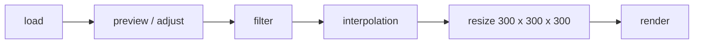

# Volume Render

> Try using a more appropriate volumetric rendering mode to render cells or other z-stack images.

## Processing

## Todos

- [x] Preview and adjust images data
- [x] Base Volume Render
- [ ] 3D Filter
- [ ] Z-data interpolation

## Reference & Thanks

- [helix-toolkits](https://github.com/helix-toolkit/helix-toolkit)
- [handycontrol](https://github.com/HandyOrg/HandyControl)